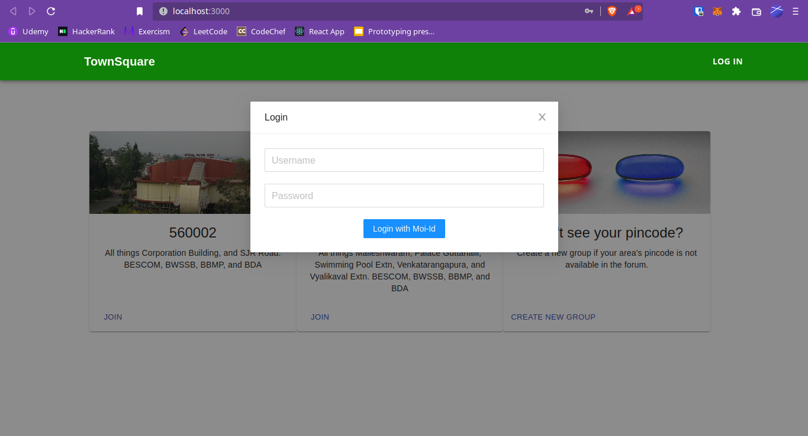

# townsquare
A public grievance forum powered by KYC-ed ZKP wallets using MOI and 10M3

## Theme picked
The theme we have picked is Smart City. The problem we are trying to solve is Public Participation.

## Team composition details
The team is composed of [Ganesh Prasad Kumble](https://github.com/0zAND1z) (Programmer implementing the screen and integrate MOI),
[Anantha Krishnan](https://github.com/aikrish) (non-technical member focused on ideation and design), and [Rahul Lenkala](https://github.com/rahullenkala)
(Programmer implementing the back end).

## Brief description of the idea
Some people inhibit themselves from complaining about the government-related issues fearing retribution
from public servants and other muscle forces. Although it is much easier to anonymize the people on online
forums, it can easily turn into nightmare by miscreants who use the platform to bully other users/reports.

We plan to build a platform where people can openly report/comment on ongoing issues in a pseudonymous
manner without fearing retribution yet participate responsibly by KYC-ing themselves using a wallet. The
platform could also democratically decide whether to reveal or hide the KYC from L&O departments in case of
malicious activities, without giving complete control to the government.

## Technological Solution
We planned to develop a governance app to raise issues and welcome fellow residents grouped by their PIN Codes to vote on the changes.
We identify each user/resident with a MOI ID, a ZK-proofed KYC-ed wallet provisioned by [10M3](https://iome.ai/). 
This way, users can sign up to a new wallet, KYC themselves, and join the public community through 10M3 wallet. 
Using this ZK-proofed and KYC-ed wallet, users can propose changes and vote on changes in a pseudonymous way, 
yet giving assurance to the government that they are actual residents without revealing their Identity publicly.

## Tech stack used
**Front End:** React.js  
**Wallet:** [10M3](https://iome.ai/)  
**Chain:** [INDUS](https://voyage.moi.technology/)  
**Languages:** JavaScript, TypeScript  

## Instructions

First things first, you'll need private beta access to the Web MOI ID SDK. You can reach out to [Sai](https://telegram.me/c1ph3rbl0ck) or [Arun](https://telegram.me/).

When you get access to the SDK, which is an npm module, you can clone it next to this project root directory.
```shell
git clone https://github.com/sarvalabs/js-moi-id.git
```

Once you have cloned the SDK, go ahead and install the dependencies:
```shell
npm i
```

Once the dependencies are installed, you'll have to link this package to your global node_modules:
```shell
npm link
```

Finally, you'll `cd` back to the project root directory and link the js-moi-id SDK here:
```shell
npm link js-moi-id
```

Now that you've setup MOI ID related dependencies, let us install other project dependencies from npm in the project.
In the project root repo, execute:
```shell
npm i
```

Finally, its now time to run the app:
```shell
npm run start
```
Once you run the app, the development server hosts the app on http://localhost:3000/

Voila, the app will now ask you to login via MOI ID as shown in the screenshot below:



Once you login, you may access the rest of the screens.

## Thank you
We'd like to thank [Arun](https://github.com/its-VSP) and [Sai](https://github.com/Arunprakash1414) for their help in integration with MOI ID and share feedback on the screens!
